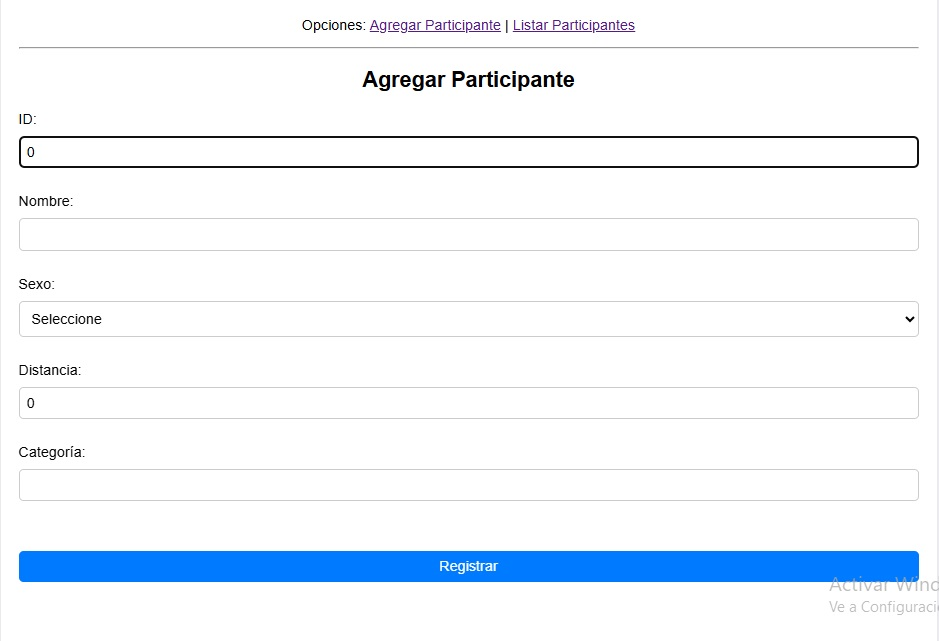
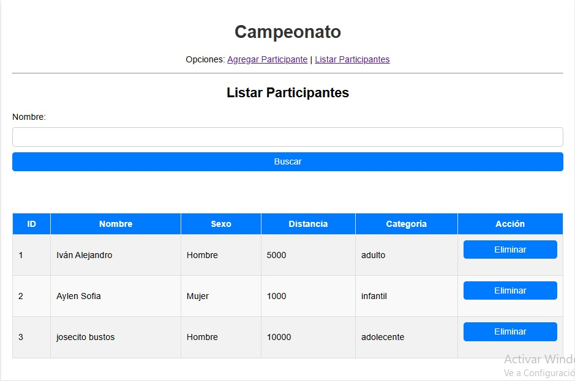

# Maratón - Gestión de Participantes

## Descripción
Esta aplicación permite gestionar participantes en un evento de maratón. Está desarrollada en Java utilizando las siguientes tecnologías:
- **NetBeans IDE 8.0.2**
- **GlassFish Server 4.1**
- **JPA (Java Persistence API)**
- **EJB (Enterprise JavaBeans)**
- **MySQL** (conector J 5.1.23)

La aplicación permite agregar, buscar, listar y eliminar participantes. Los datos se gestionan de forma persistente en la base de datos.

---

## Características principales
- **Gestión de participantes**: CRUD completo (Crear, Leer, Actualizar, Eliminar).
- **Validación de datos**: Se asegura la integridad y consistencia al registrar o actualizar participantes.
- **Persistencia**: Uso de JPA para la interacción con la base de datos.
- **Arquitectura robusta**: Implementación basada en EJB para lógica empresarial.

---

## Capturas de pantalla

### 1. Pantalla principal
Muestra la interfaz principal de la aplicación donde se gestionan los participantes.


---

### 2. Registro de participante
Formulario para agregar un nuevo participante con validaciones incluidas.



---

### 3. Listado de participantes
Vista del listado de todos los participantes registrados en la base de datos.



---

## Configuración del proyecto

### Prerrequisitos
- **NetBeans IDE 8.0.2**
- **GlassFish Server 4.1**
- **MySQL** (Versión 5.7 o superior)

### Configuración de la base de datos
1. Crear la base de datos llamada `maraton` con la tabla `participante`:
   ```sql
   CREATE DATABASE maraton;

   USE maraton;

   CREATE TABLE participante (
       id INT AUTO_INCREMENT PRIMARY KEY,
       nombre VARCHAR(100) NOT NULL,
       sexo VARCHAR(10) NOT NULL,
       distancia INT NOT NULL,
       categoria VARCHAR(50) NOT NULL
   );
